# Pact Contract Testing Framework

Production-ready consumer-driven contract testing implementation using Pact JVM with JUnit 5, Rest Assured, and Lombok.

**What is Pact?** Contract testing framework that verifies API compatibility between consumer and provider services without end-to-end integration tests.

**What's Included:**
- Complete consumer + provider test examples
- JSONPlaceholder API integration (free test API)
- HTML dashboard for contract visualization
- Compatible package versions for Java 17
- Jenkins + Drone CI/CD examples

📖 **[Read Technical Documentation](TECHNICAL.md)** - Detailed guide with Mermaid diagrams

## Project Structure

```
jvm-pact/
├── shared/                          # Shared data models
│   └── src/main/java/
│       └── model/
│           ├── User.java            # User model with Lombok
│           └── Post.java            # Post model with Lombok
├── consumer/                        # Consumer (API Client)
│   ├── src/main/java/
│   │   └── UserServiceClient.java  # Rest Assured HTTP client
│   └── src/test/java/
│       └── UserServicePactTest.java # Contract tests
├── provider/                        # Provider (API Service)
│   └── src/test/java/
│       └── UserServiceProviderPactTest.java  # Verification tests
├── docs/
│   └── view-reports.html           # Single-page HTML dashboard
└── pom.xml                         # Parent POM with versions
```

## Two Approaches: Choose Your Path

This framework supports **both** file-based (simple) and broker-based (advanced) workflows:

```mermaid
graph LR
    A1["📝 Consumer"] -->|generates| B1["📄 JSON Files"]
    B1 -->|reads| C1["✅ Provider"]
    
    A2["📝 Consumer"] -->|publishes| B2["🌐 Pact Broker"]
    B2 -->|loads| C2["✅ Provider"]
    B2 -.-> D2["📊 Dashboard"]
    
    style B1 stroke:#1976d2,stroke-width:4px
    style B2 stroke:#f57c00,stroke-width:4px
    style D2 stroke:#f57c00,stroke-width:3px
```



**When to Use Each:**
- **File-Based**: Learning, prototyping, single team (1-5 developers)
- **Broker-Based**: Multiple teams, CI/CD gates, versioning, webhooks

## Prerequisites

**File-Based (Minimum):**
- Java 17 (LTS)
- Maven 3.8+

**Broker-Based (Additional):**
- Docker Desktop (for Pact Broker)

## Technology Stack

| Technology | Version | Purpose |
|------------|---------|---------|
| Java | 17 LTS | Runtime |
| Pact JVM | 4.6.15 | Contract testing |
| JUnit 5 | 5.10.3 | Test framework |
| Rest Assured | 5.5.0 | HTTP client |
| Lombok | 1.18.36 | Reduce boilerplate |
| WireMock | 3.9.2 | Mock server |
| Maven | 3.13.0 | Build tool |

## Essential Commands

```bash
# Run all tests
mvn clean test

# Run specific module
mvn test -pl consumer
mvn test -pl provider

# Verbose output
mvn test -X

# Skip tests
mvn install -DskipTests
```

## File Locations

| Item | Path |
|------|------|
| Consumer Tests | `consumer/src/test/java/` |
| Provider Tests | `provider/src/test/java/` |
| Pact Contracts | `consumer/target/pacts/*.json` |
| HTML Report | `docs/view-reports.html` |

## Quick Start

```bash
# 1. Clone and build
mvn clean install

# 2. Run tests
mvn clean test

# 3. View report
open docs/view-reports.html
```

**Expected Output:**
- Consumer Tests: 4/4 passed
- Provider Tests: 4/4 passed
- Contract: `consumer/target/pacts/*.json`
- HTML Report: `docs/view-reports.html`

## CI/CD Integration

### Jenkins Pipeline

```groovy
pipeline {
    agent any
    
    tools {
        maven 'Maven 3.8'
        jdk 'JDK 17'
    }
    
    stages {
        stage('Test') {
            steps {
                sh 'mvn clean test'
            }
        }
        
        stage('Archive Artifacts') {
            steps {
                archiveArtifacts artifacts: 'consumer/target/pacts/*.json'
                publishHTML([
                    reportDir: 'docs',
                    reportFiles: 'view-reports.html',
                    reportName: 'Pact Contract Report'
                ])
            }
        }
    }
}
```

### Drone CI

```yaml
kind: pipeline
type: docker
name: pact-tests

steps:
  - name: test
    image: maven:3.8-openjdk-17
    commands:
      - mvn clean test

  - name: publish-contracts
    image: plugins/s3
    settings:
      bucket: pact-contracts
      source: consumer/target/pacts/*.json
      target: /contracts/${DRONE_COMMIT_SHA}
    when:
      branch:
        - main

  - name: publish-report
    image: plugins/s3
    settings:
      bucket: pact-reports
      source: docs/view-reports.html
      target: /reports/${DRONE_COMMIT_SHA}.html
    when:
      branch:
        - main
```

## Reports

**HTML Dashboard:** `docs/view-reports.html`
- Test statistics and pass rate
- HTTP method indicators
- Request/response details
- No external dependencies

**Pact Contract JSON:** `consumer/target/pacts/*.json`
- Standard Pact specification format
- Can be published to Pact Broker

## Pact Broker Setup (Optional)

**What is Pact Broker?** Central repository for storing and sharing Pact contracts across teams. Provides versioning, can-i-deploy checks, and automated provider verification.

**When to Use:**
- ✅ Multiple teams/services need shared contracts
- ✅ Need deployment gates (can-i-deploy)
- ✅ Want automated provider verification
- ❌ Single team prototyping (file-based is simpler)

### Quick Start

**1. Start Pact Broker**
```bash
docker-compose up -d

# Verify broker is running
curl http://localhost:9292
```

**2. Publish Consumer Contracts**
```bash
cd consumer
mvn clean test  # Generate contracts
mvn pact:publish
```

**3. Verify Provider with Broker**
```bash
cd provider
mvn test -Dtest=UserServiceProviderPactBrokerTest
```

**4. View Contracts**
- Browser: http://localhost:9292
- Credentials: None required (open access)

### Configuration

**Maven Plugin (already configured in consumer/pom.xml):**
```xml
<plugin>
    <groupId>au.com.dius.pact.provider</groupId>
    <artifactId>maven</artifactId>
    <configuration>
        <pactBrokerUrl>http://localhost:9292</pactBrokerUrl>
        <projectVersion>${project.version}</projectVersion>
        <tags>
            <tag>dev</tag>
        </tags>
    </configuration>
</plugin>
```

**Provider Test Options:**
- `UserServiceProviderPactTest` - Uses @PactFolder (file-based)
- `UserServiceProviderPactBrokerTest` - Uses @PactBroker (broker-based)

### CI/CD with Broker

**Jenkins Example:**
```groovy
stage('Publish to Broker') {
    steps {
        sh 'cd consumer && mvn pact:publish'
    }
}

stage('Can I Deploy?') {
    steps {
        sh '''
            docker run --rm --network=host \
            pactfoundation/pact-cli:latest \
            broker can-i-deploy \
            --pacticipant=UserServiceConsumer \
            --version=${GIT_COMMIT} \
            --to=production \
            --broker-base-url=http://localhost:9292
        '''
    }
}
```

**Benefits:**
- Version tracking across environments
- Deployment gates prevent breaking changes
- Webhooks trigger provider tests automatically
- Team collaboration via web UI

## Troubleshooting

**Test Failure: "TempDirFactory ClassNotFoundException"**
- Using JUnit 5.10.3 (not 5.11.3+)

**Accept Header Mismatch**
- Use `header("Accept", "application/json")` not `accept(ContentType.JSON)`

**Lombok Not Working**
- Requires Java 17 LTS

**404 Response Content-Type**
- Add `.withHeader("Content-Type", "application/json")` to WireMock 404 stubs

**Debug Mode:**
```bash
mvn test -X  # Verbose output
mvn test -Dpact.showStacktrace=true  # Pact details
```

## Resources

- [Pact Official Docs](https://docs.pact.io/)
- [Pact JVM GitHub](https://github.com/pact-foundation/pact-jvm)
- [Rest Assured](https://rest-assured.io/)
- [Lombok](https://projectlombok.org/)
- [Contract Testing Guide](https://martinfowler.com/articles/consumerDrivenContracts.html)

## Support

For issues or questions:
1. Check the Troubleshooting section
2. Review Pact documentation at https://docs.pact.io/
3. Open an issue in this repository

