# Technical Documentation

## Table of Contents
- [Understanding Pact](#understanding-pact)
- [How It Works](#how-it-works)
- [Architecture](#architecture)
- [Test Flow](#test-flow)
- [Code Deep Dive](#code-deep-dive)
- [Best Practices](#best-practices)
- [Troubleshooting](#troubleshooting)

## Understanding Pact

Pact is a consumer-driven contract testing framework that verifies API compatibility between services without requiring end-to-end integration tests.

**Key Concepts:**
- **Consumer**: Service that calls an API (API client)
- **Provider**: Service that implements the API (API server)
- **Contract**: JSON file defining API expectations (request/response pairs)

**How It Differs:** Traditional integration testing requires running all services simultaneously. Pact allows independent testing through contracts.

## How It Works

### Step 1: Consumer Defines Contract

Consumer writes tests defining what it expects from the provider:

**Code Example:**

```java
@Pact(consumer = "UserServiceConsumer", provider = "UserServiceProvider")
public V4Pact getUserById(PactDslWithProvider builder) {
    return builder
        .given("user with id 10 exists")
        .uponReceiving("a request to get user with id 10")
            .path("/users/10")
            .method("GET")
            .headers("Accept", "application/json")
        .willRespondWith()
            .status(200)
            .body(newJsonBody(user -> {
                user.integerType("id", 10);
                user.stringType("name", "John Doe");
                user.stringType("email", "john@example.com");
            }))
        .toPact(V4Pact.class);
}
```

**Generated Contract:**

```json
{
  "consumer": {"name": "UserServiceConsumer"},
  "provider": {"name": "UserServiceProvider"},
  "interactions": [{
    "description": "a request to get user with id 10",
    "providerState": "user with id 10 exists",
    "request": {
      "method": "GET",
      "path": "/users/10",
      "headers": {"Accept": "application/json"}
    },
    "response": {
      "status": 200,
      "body": {"id": 10, "name": "John Doe", "email": "john@example.com"}
    }
  }]
}
```

### Step 2: Provider Verifies Contract

Provider reads the contract and proves it can satisfy the expectations:

**Code Example:**

```java
@TestTemplate
@ExtendWith(PactVerificationInvocationContextProvider.class)
void pactVerificationTestTemplate(PactVerificationContext context) {
    context.verifyInteraction();
}

@State("user with id 10 exists")
void setupUserExists() {
    User user = new User(10, "John Doe", "john", "john@example.com", 
                         "123-456-7890", "example.com");
    
    wireMockServer.stubFor(get(urlEqualTo("/users/10"))
        .willReturn(aResponse()
            .withStatus(200)
            .withHeader("Content-Type", "application/json")
            .withBody(objectMapper.writeValueAsString(user))));
}
```

## Architecture

### File-Based Approach (Default)


**How it works:**
1. Consumer writes `@Pact` tests defining API expectations
2. Tests generate JSON contracts to `target/pacts/`
3. Provider uses `@PactFolder` to read contracts from filesystem
4. HTML dashboard visualizes contracts (no external dependencies)

### Broker-Based Approach (Optional)


**How it works:**
1. Consumer tests publish contracts to broker via Maven plugin
2. Broker stores contracts with versions and tags in Postgres
3. Provider uses `@PactBroker` to load contracts from broker
4. Web UI at http://localhost:9292 shows all contracts, versions, and verification status

## Test Flow

### Consumer Test Flow

1. JUnit starts consumer test
2. `@Pact` annotation defines interaction
3. Pact starts mock server on random port
4. Test makes HTTP request via Rest Assured
5. Mock server returns predefined response
6. Test verifies response structure
7. Pact writes contract to `target/pacts/`

### Provider Test Flow

1. JUnit starts provider test
2. `@PactFolder` loads contract JSON
3. For each interaction in contract:
   - Apply `@State` handler
   - Configure WireMock stub
   - Replay HTTP request
   - Verify response matches contract
4. All interactions must pass

## Code Deep Dive

### Data Models (Shared)

Uses Lombok to reduce boilerplate:

```java
@Data                    // Generates getters, setters, toString, equals, hashCode
@NoArgsConstructor       // Default constructor for Jackson
@AllArgsConstructor      // Constructor with all fields
@JsonIgnoreProperties(ignoreUnknown = true)  // Ignore extra fields from API
public class User {
    private Integer id;
    private String name;
    private String username;
    private String email;
    private String phone;
    private String website;
}
```

Without Lombok, this would be 70+ lines of boilerplate code.

### HTTP Client (Consumer)

Rest Assured client with Lombok logging:

```java
@Slf4j  // Generates private static final Logger log
public class UserServiceClient {
    private final String baseUrl;
    
    public List<User> getAllUsers() {
        log.info("Fetching all users from {}", baseUrl);
        
        return Arrays.asList(given()
            .baseUri(baseUrl)
            .header("Accept", "application/json")  // Critical: exact header match
        .when()
            .get("/users")
        .then()
            .statusCode(200)
            .extract()
            .as(User[].class));
    }
}
```

**Key Points:**
- Use `header("Accept", "application/json")` not `accept(ContentType.JSON)`
- ContentType.JSON adds multiple accept types, breaking contract matching
- Explicit headers ensure exact contract compliance

### Consumer Test (Contract Definition)

```java
@ExtendWith(PactConsumerTestExt.class)
@PactTestFor(providerName = "UserServiceProvider")
public class UserServicePactTest {

    @Pact(consumer = "UserServiceConsumer")
    public V4Pact getAllUsers(PactDslWithProvider builder) {
        return builder
            .given("users exist")                    // Provider state
            .uponReceiving("a request to get all users")
                .path("/users")
                .method("GET")
                .headers("Accept", "application/json")
            .willRespondWith()
                .status(200)
                .body(newJsonArrayMinLike(2, array -> array.object(user -> {
                    user.integerType("id", 1);       // Type matching, not exact values
                    user.stringType("name", "John");
                    user.stringType("username", "john");
                    user.stringType("email", "john@example.com");
                    user.stringType("phone", "123-456-7890");
                    user.stringType("website", "example.com");
                })))
            .toPact(V4Pact.class);
    }

    @Test
    void testGetAllUsers(MockServer mockServer) {
        UserServiceClient client = new UserServiceClient(mockServer.getUrl());
        List<User> users = client.getAllUsers();
        
        assertNotNull(users);
        assertTrue(users.size() >= 2);  // Contract says "at least 2"
    }
}
```

**Important:**
- `given()` defines provider state name
- `integerType()`, `stringType()` use type matching (flexible)
- `integerValue()`, `stringValue()` use exact matching (brittle)
- Test verifies consumer's needs, not exact API response

### Provider Test (Contract Verification)

```java
@ExtendWith(PactVerificationInvocationContextProvider.class)
@Provider("UserServiceProvider")
@PactFolder("../consumer/target/pacts")
public class UserServiceProviderPactTest {

    @RegisterExtension
    static WireMockExtension wireMockServer = WireMockExtension.newInstance()
        .options(wireMockConfig().dynamicPort())
        .build();

    @BeforeEach
    void setup(PactVerificationContext context) {
        context.setTarget(new HttpTestTarget("localhost", 
                          wireMockServer.getPort()));
    }

    @TestTemplate
    @ExtendWith(PactVerificationInvocationContextProvider.class)
    void pactVerificationTestTemplate(PactVerificationContext context) {
        context.verifyInteraction();  // Pact replays all interactions
    }

    @State("users exist")
    void setupUsersExist() throws JsonProcessingException {
        List<User> users = Arrays.asList(
            new User(1, "John Doe", "john", "john@example.com", 
                    "123-456-7890", "example.com"),
            new User(2, "Jane Smith", "jane", "jane@example.com", 
                    "098-765-4321", "example.org")
        );
        
        wireMockServer.stubFor(get(urlEqualTo("/users"))
            .willReturn(aResponse()
                .withStatus(200)
                .withHeader("Content-Type", "application/json")
                .withBody(objectMapper.writeValueAsString(users))));
    }

    @State("user with id 999 does not exist")
    void setupUserNotFound() {
        wireMockServer.stubFor(get(urlEqualTo("/users/999"))
            .willReturn(aResponse()
                .withStatus(404)
                .withHeader("Content-Type", "application/json")  // Important!
                .withBody("{}")));
    }
}
```

**Critical Details:**
- `@State` method name MUST match `given()` in consumer test
- WireMock runs on dynamic port to avoid conflicts
- 404 responses MUST set Content-Type header (defaults to text/plain)
- ObjectMapper serializes POJOs to JSON matching contract types

## Best Practices

### Contract Design

**✅ Do:**
- Use type matchers (`integerType`, `stringType`) for flexibility
- Test both success and error scenarios (404, 500)
- Keep contracts minimal (only fields consumer actually uses)
- Use meaningful provider state names

**❌ Don't:**
- Use exact value matchers unless truly required
- Test implementation details
- Include fields consumer doesn't need
- Couple contracts to database IDs

### Version Compatibility

| Component | Version | Why This Version |
|-----------|---------|------------------|
| JUnit | 5.10.3 | 5.11.3+ breaks TempDirFactory |
| Pact JVM | 4.6.15 | Stable, compatible with JUnit 5.10.3 |
| Surefire | 3.2.5 | Matches JUnit 5.10.3 |
| Java | 17 LTS | Stable, full tooling support |

### Logging Configuration

Logback configured to reduce noise:

```xml
<configuration>
    <appender name="STDOUT" class="ch.qos.logback.core.ConsoleAppender">
        <encoder>
            <pattern>%d{HH:mm:ss.SSS} %-5level %logger{36} - %msg%n</pattern>
        </encoder>
    </appender>
    
    <logger name="au.com.dius.pact" level="INFO"/>
    <logger name="org.apache.http" level="WARN"/>
    
    <root level="INFO">
        <appender-ref ref="STDOUT"/>
    </root>
</configuration>
```

## Troubleshooting

### Common Issues

**1. Accept Header Mismatch**

```java
// ❌ Wrong - adds multiple accept types
.accept(ContentType.JSON)

// ✅ Correct - exact header match
.header("Accept", "application/json")
```

**2. Missing Content-Type on 404**

```java
// ❌ Wrong - defaults to text/plain
wireMockServer.stubFor(get("/users/999")
    .willReturn(aResponse().withStatus(404).withBody("{}")));

// ✅ Correct - explicit Content-Type
wireMockServer.stubFor(get("/users/999")
    .willReturn(aResponse()
        .withStatus(404)
        .withHeader("Content-Type", "application/json")
        .withBody("{}")));
```

**3. Provider State Mismatch**

```java
// Consumer test
.given("user exists")  // ❌ Wrong

// Provider test
@State("users exist")  // Different name - won't match!

// ✅ Correct - exact match required
.given("users exist")
@State("users exist")
```

**4. Lombok Not Working**

```bash
# Check Java version
java --version  # Must be Java 17 LTS

# Ensure annotation processing enabled in IDE
# IntelliJ: Settings → Build → Compiler → Annotation Processors
```

### Debug Mode

```bash
# Verbose Maven output
mvn test -X

# Show Pact verification details
mvn test -Dpact.showStacktrace=true

# Check generated contracts
cat consumer/target/pacts/*.json | jq .
```

## Scaling to Production

**Small Teams (1-10 services):**
- Commit Pact JSON to Git
- Use HTML dashboard
- Manual coordination

**Medium Teams (10-50 services):**
- Add Pact Broker (self-hosted)
- Central contract repository
- Automated provider tests via webhooks
- Can-I-Deploy compatibility checks

**Large Teams (50+ services):**
- Use PactFlow (hosted Pact Broker)
- Bi-directional contracts
- Enterprise support and analytics

## Upgrading to Pact Broker

### Overview


**What Changes:**
- Consumer: Publishes contracts to Broker via Maven plugin
- Provider: Loads contracts from Broker using @PactBroker annotation
- CI/CD: Adds can-i-deploy checks before deployment

**What Stays:**
- Test code logic remains identical
- Provider states (@State methods) unchanged
- WireMock setup unchanged

### Step-by-Step Migration

**1. Start Pact Broker**

```bash
# Already included in this framework
docker-compose up -d

# Verify
curl http://localhost:9292/diagnostic/status/heartbeat
```

**docker-compose.yml** (already created):
```yaml
services:
  postgres:
    image: postgres:15-alpine
    environment:
      POSTGRES_USER: pact
      POSTGRES_PASSWORD: pact
      POSTGRES_DB: pact_broker
  
  pact-broker:
    image: pactfoundation/pact-broker:latest
    depends_on:
      - postgres
    ports:
      - "9292:9292"
```

**2. Configure Maven Plugin**

Already added to `consumer/pom.xml`:

```xml
<plugin>
    <groupId>au.com.dius.pact.provider</groupId>
    <artifactId>maven</artifactId>
    <version>${pact.version}</version>
    <configuration>
        <pactBrokerUrl>http://localhost:9292</pactBrokerUrl>
        <pactDirectory>target/pacts</pactDirectory>
        <projectVersion>${project.version}</projectVersion>
        <tags>
            <tag>dev</tag>
        </tags>
    </configuration>
</plugin>
```

**3. Publish Contracts**

```bash
cd consumer
mvn clean test    # Generate contracts
mvn pact:publish  # Upload to broker

# Verify in browser
open http://localhost:9292
```

**Output:**
```
Publishing UserServiceConsumer/UserServiceProvider pact to Pact Broker
Successfully published pact: 1.0.0-SNAPSHOT
```

**4. Update Provider Tests**

**Option A: Keep Both (Recommended for Learning)**

Keep `UserServiceProviderPactTest.java` (file-based) and add:

```java
@Provider("UserServiceProvider")
@PactBroker(
    host = "localhost",
    port = "9292",
    scheme = "http",
    tags = {"dev"}
)
class UserServiceProviderPactBrokerTest {
    // Same @State methods as file-based test
}
```

**Option B: Replace (Production Approach)**

Replace `@PactFolder` with `@PactBroker`:

```java
// Before
@PactFolder("../consumer/target/pacts")

// After
@PactBroker(
    host = "localhost",
    port = "9292",
    scheme = "http",
    tags = {"dev"}
)
```

**5. Run Provider Verification**

```bash
cd provider
mvn test -Dtest=UserServiceProviderPactBrokerTest
```

**Expected Output:**
```
Verifying pact between UserServiceConsumer (1.0.0-SNAPSHOT) and UserServiceProvider
  [OK] a request to get all users
  [OK] a request to get user with id 10
  [OK] a request for non-existent user
  [OK] a request when no users exist
```

**6. Add Can-I-Deploy Check**

```bash
# Check if consumer can be deployed to production
docker run --rm --network=host \
  pactfoundation/pact-cli:latest \
  broker can-i-deploy \
  --pacticipant=UserServiceConsumer \
  --version=1.0.0-SNAPSHOT \
  --to=production \
  --broker-base-url=http://localhost:9292
```

**Output (Success):**
```
Computer says yes \o/
CONSUMER       | C.VERSION | PROVIDER       | P.VERSION | SUCCESS
---------------|-----------|----------------|-----------|--------
UserServiceConsumer | 1.0.0-SNAPSHOT | UserServiceProvider | 1.0.0 | true
```

**Output (Failure):**
```
Computer says no ¯\_(ツ)_/¯
Provider verification not found for UserServiceProvider version 1.0.0
```

### Broker Features

**1. Versioning**

```bash
# Publish with version
mvn pact:publish -Dpact.consumer.version=1.2.3

# Publish with Git commit
mvn pact:publish -Dpact.consumer.version=$(git rev-parse HEAD)
```

**2. Tags (Environments)**

```bash
# Tag as production
docker run --rm pactfoundation/pact-cli:latest \
  broker create-version-tag \
  --pacticipant=UserServiceConsumer \
  --version=1.2.3 \
  --tag=production \
  --broker-base-url=http://localhost:9292
```

**3. Webhooks (Auto-Trigger Provider Tests)**

```bash
# Trigger provider tests when consumer publishes
docker run --rm pactfoundation/pact-cli:latest \
  broker create-webhook \
  --broker-base-url=http://localhost:9292 \
  --request=POST \
  --url=https://jenkins.example.com/job/provider-tests/build \
  --consumer=UserServiceConsumer \
  --provider=UserServiceProvider
```

**4. Matrix Query (Compatibility)**

```bash
# Check all versions compatibility
docker run --rm pactfoundation/pact-cli:latest \
  broker can-i-deploy \
  --pacticipant=UserServiceConsumer \
  --pacticipant=UserServiceProvider \
  --broker-base-url=http://localhost:9292
```

### CI/CD Integration

**Jenkins Pipeline:**

```groovy
pipeline {
    stages {
        stage('Consumer Test + Publish') {
            steps {
                sh 'cd consumer && mvn clean test'
                sh 'cd consumer && mvn pact:publish'
            }
        }
        
        stage('Can I Deploy?') {
            steps {
                script {
                    def result = sh(
                        script: '''
                            docker run --rm --network=host \
                            pactfoundation/pact-cli:latest \
                            broker can-i-deploy \
                            --pacticipant=UserServiceConsumer \
                            --version=${GIT_COMMIT} \
                            --to=production \
                            --broker-base-url=http://localhost:9292
                        ''',
                        returnStatus: true
                    )
                    if (result != 0) {
                        error "Cannot deploy: Pact verification failed"
                    }
                }
            }
        }
        
        stage('Deploy') {
            steps {
                sh './deploy.sh'
            }
        }
    }
}
```

**Drone CI:**

```yaml
kind: pipeline
name: consumer

steps:
  - name: test
    image: maven:3.8-openjdk-17
    commands:
      - cd consumer
      - mvn clean test
      - mvn pact:publish

  - name: can-i-deploy
    image: pactfoundation/pact-cli:latest
    commands:
      - broker can-i-deploy
        --pacticipant=UserServiceConsumer
        --version=${DRONE_COMMIT_SHA}
        --to=production
        --broker-base-url=http://pact-broker:9292
```

### Comparison: File-Based vs Broker

```mermaid
graph LR
    F1["Consumer<br/>mvn test"] --> F2["JSON Files<br/>target/pacts"]
    F2 --> F3["Provider<br/>mvn test"]
    F3 --> F4["✅ Pass/Fail"]
    
    B1["Consumer<br/>mvn test"] --> B2["Pact Broker<br/>:9292"]
    B2 --> B3["Provider<br/>mvn test"]
    B2 -.-> B4["📊 Web UI"]
    B2 -.-> B5["🚦 Gates"]
    
    style F2 stroke:#1976d2,stroke-width:4px
    style F4 stroke:#43a047,stroke-width:3px
    style B2 stroke:#f57c00,stroke-width:4px
    style B4 stroke:#f57c00,stroke-width:3px
    style B5 stroke:#7b1fa2,stroke-width:3px
```



| Feature | File-Based (@PactFolder) | Broker (@PactBroker) |
|---------|-------------------------|---------------------|
| Setup | No infrastructure | Requires Docker |
| Team Size | 1-5 developers | 5+ developers |
| Versioning | Manual (Git) | Automatic |
| Can-I-Deploy | No | Yes |
| Webhooks | No | Yes |
| Web UI | Local HTML | Centralized dashboard |
| CI/CD | Simple | Advanced gates |
| Cost | Free | Free (OSS) or Paid (PactFlow) |
| Best For | Learning, prototyping | Production, microservices |

### Troubleshooting Broker

**1. Broker Not Starting**

```bash
# Check logs
docker-compose logs pact-broker

# Common issue: Postgres not ready
# Solution: Wait 10 seconds, broker will retry
```

**2. Publish Fails**

```bash
# Verify broker is accessible
curl http://localhost:9292

# Check Maven plugin version matches Pact version
grep pact.version pom.xml
```

**3. Provider Can't Load Contracts**

```bash
# Verify contracts exist in broker
curl http://localhost:9292/pacts/provider/UserServiceProvider/latest

# Check @PactBroker annotation matches broker URL
```

**4. Can-I-Deploy Always Fails**

```bash
# Ensure provider has verified and published results
cd provider
mvn test -Dtest=UserServiceProviderPactBrokerTest
mvn pact:publish  # If provider also publishes verification results
```

### Production Considerations

**Self-Hosted Pact Broker:**
- Use Kubernetes or ECS for high availability
- Add authentication (PACT_BROKER_BASIC_AUTH)
- Enable SSL/TLS (PACT_BROKER_BASE_URL=https://...)
- Regular Postgres backups

**PactFlow (Commercial):**
- Hosted solution, no infrastructure
- Advanced analytics and insights
- Bi-directional contract testing
- Enterprise support
- Pricing: ~$10/user/month

**Best Practices:**
- Use Git commit SHA as version number
- Tag versions by environment (dev, staging, prod)
- Set up webhooks for automatic provider verification
- Use can-i-deploy in CI/CD before deployment
- Monitor broker health and database size


